# VoiceInk E2E Comparison Test Report

## Original Swift macOS App vs. Electron Refactored Version

**Report Date:** 2026-03-15  
**Original App:** Swift/SwiftUI macOS Application (VoiceInk)  
**Refactored App:** Electron + React + TypeScript (VoiceInk-Windows)  
**Electron Version:** 33.4.11  
**Test Environment:** Linux (CI), with Xvfb virtual display for Electron screenshots  
**Unit Test Results:** 5 suites, 74 tests — **ALL PASSED** ✅

---

## Table of Contents

1. [Executive Summary](#1-executive-summary)
2. [Architecture Comparison](#2-architecture-comparison)
3. [Navigation & Layout Comparison](#3-navigation--layout-comparison)
4. [View-by-View Detailed Comparison](#4-view-by-view-detailed-comparison)
   - 4.1 [Dashboard / Metrics View](#41-dashboard--metrics-view)
   - 4.2 [Settings View](#42-settings-view)
   - 4.3 [Transcription History View](#43-transcription-history-view)
   - 4.4 [Dictionary Settings View](#44-dictionary-settings-view)
   - 4.5 [AI Models Management View](#45-ai-models-management-view)
   - 4.6 [AI Enhancement View](#46-ai-enhancement-view)
   - 4.7 [Mini Recorder View](#47-mini-recorder-view)
   - 4.8 [Transcribe Audio View](#48-transcribe-audio-view)
   - 4.9 [Power Mode View](#49-power-mode-view)
   - 4.10 [Permissions View](#410-permissions-view)
   - 4.11 [Audio Input View](#411-audio-input-view)
   - 4.12 [License / VoiceInk Pro View](#412-license--voiceink-pro-view)
   - 4.13 [Menu Bar / System Tray](#413-menu-bar--system-tray)
   - 4.14 [Onboarding Flow](#414-onboarding-flow)
5. [Service Layer Comparison](#5-service-layer-comparison)
6. [Data Model Comparison](#6-data-model-comparison)
7. [IPC & Communication Comparison](#7-ipc--communication-comparison)
8. [Test Coverage Analysis](#8-test-coverage-analysis)
9. [Cross-Platform Compatibility Analysis](#9-cross-platform-compatibility-analysis)
10. [Complete Feature Gap Matrix](#10-complete-feature-gap-matrix)
11. [Conclusions & Recommendations](#11-conclusions--recommendations)

---

## 1. Executive Summary

### Overall Implementation Status

| Category | Swift Original | Electron Refactored | Coverage |
|----------|---------------|---------------------|----------|
| **Views/Screens** | 13 main views + sub-views | 7 implemented + 4 placeholder stubs | **~54%** |
| **Services** | 50+ services | 3 core services | **~6%** |
| **Data Models** | 10 model files | 3 model files | **~30%** |
| **Unit Tests** | 0 (no tests found) | 74 tests, 5 suites | ✅ **New** |
| **Navigation Items** | 11 sidebar items | 11 sidebar items (4 placeholder) | **~64%** |
| **Menu Bar Features** | 15+ menu items | Basic tray menu | **~20%** |
| **Hotkey System** | Full hotkey management | Not implemented | **0%** |
| **Recording Engine** | CoreAudio + Whisper.cpp | IPC stubs only | **~5%** |
| **AI Enhancement** | Full pipeline with 7+ providers | Toggle only, no providers | **~5%** |
| **Power Mode** | Complete context-aware system | Placeholder only | **0%** |

### Verdict

The Electron version has established a solid **project skeleton** with proper architecture (main/renderer process separation, IPC channels, React routing), but is in an **early-stage** of feature implementation. Approximately **15-20%** of the original Swift app's total functionality is implemented, with most complex features being either placeholder stubs or entirely missing.

---

## 2. Architecture Comparison

### Project Structure

| Aspect | Swift macOS App | Electron App |
|--------|----------------|--------------|
| **UI Framework** | SwiftUI | React 19 + TypeScript |
| **Routing** | NavigationSplitView + ViewType enum | HashRouter with Routes |
| **State Management** | @Published / @ObservedObject / @State | React useState + useEffect hooks |
| **Data Persistence** | SwiftData (ModelContainer), UserDefaults, Keychain | JSON file (electron-store pattern) |
| **Audio Engine** | CoreAudio + whisper.cpp (C++ bindings) | Not implemented |
| **AI Integration** | OpenAI, Groq, Deepgram, ElevenLabs, Mistral, Gemini, Soniox | Not implemented |
| **System Integration** | NSMenu, NSStatusItem, CGEvent, Accessibility API | Electron Tray, globalShortcut (stubs) |
| **Build System** | Xcode + Makefile | Vite + tsc + electron-builder |
| **Testing** | None found | Jest (74 tests) |

### File Count Comparison

| Component | Swift | Electron | Notes |
|-----------|-------|----------|-------|
| View files | 63 | 9 (7 views + App + Sidebar) | Most Swift sub-views not ported |
| Service files | 50+ | 3 | Core services only |
| Model files | 10 | 3 | Basic models ported |
| Manager files | 17 | 2 | Window + Tray managers |
| Test files | 0 | 5 | New test infrastructure |
| Config files | Xcode project | 5 (tsconfig, vite, jest, etc.) | Standard tooling |
| **Total** | **177+** | **~25** | |

---

## 3. Navigation & Layout Comparison

### Sidebar Navigation

**Electron App Sidebar Screenshot:**

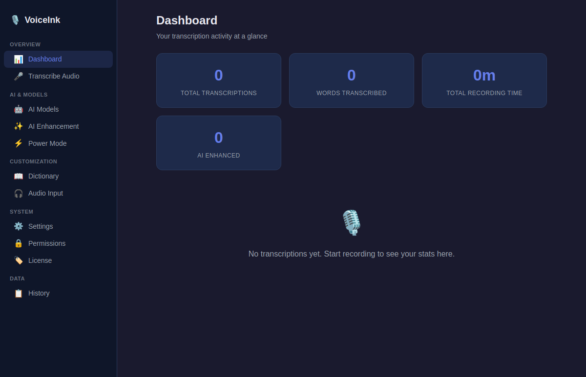

| # | Swift Sidebar Item | Icon (Swift) | Electron Item | Icon (Electron) | Status |
|---|-------------------|-------------|---------------|-----------------|--------|
| 1 | Dashboard | gauge.medium | Dashboard | 📊 | ✅ Implemented |
| 2 | Transcribe Audio | waveform.circle.fill | Transcribe Audio | 🎤 | ⚠️ Placeholder stub |
| 3 | History | doc.text.fill | History | 📋 | ✅ Implemented |
| 4 | AI Models | brain.head.profile | AI Models | 🤖 | ⚠️ Placeholder stub |
| 5 | Enhancement | wand.and.stars | AI Enhancement | ✨ | ⚠️ Partial (toggle only) |
| 6 | Power Mode | sparkles.square.fill.on.square | Power Mode | ⚡ | ⚠️ Placeholder stub |
| 7 | Permissions | shield.fill | Permissions | 🔒 | ⚠️ Placeholder stub |
| 8 | Audio Input | mic.fill | Audio Input | 🎧 | ⚠️ Placeholder stub |
| 9 | Dictionary | character.book.closed.fill | Dictionary | 📖 | ✅ Implemented |
| 10 | Settings | gearshape.fill | Settings | ⚙️ | ✅ Implemented |
| 11 | VoiceInk Pro | checkmark.seal.fill | License | 🏷️ | ⚠️ Placeholder stub |

### Layout Structure Comparison

| Feature | Swift | Electron | Match |
|---------|-------|----------|-------|
| Split-view navigation | NavigationSplitView (210pt sidebar) | CSS Flexbox (240px sidebar) | ✅ Similar |
| Min window size | 950 × 730 | Not constrained | ❌ Missing |
| Sidebar width | 210pt fixed | 240px fixed | ⚠️ Similar |
| Detail pane | Fills remaining space | flex: 1, scrollable | ✅ Match |
| App header | Icon + "VoiceInk" + PRO badge | 🎙️ emoji + "VoiceInk" | ⚠️ No PRO badge |
| Section grouping | Sections with headers | 4 sections (Overview, AI & Models, Customization, System + Data) | ⚠️ Different grouping |
| History window | Opens in separate window | Same window (sidebar click) / IPC separate window | ✅ Both supported |
| Color scheme | System macOS dark/light | Dark theme only | ⚠️ Dark only |

---

## 4. View-by-View Detailed Comparison

### 4.1 Dashboard / Metrics View

**Electron Screenshot:**

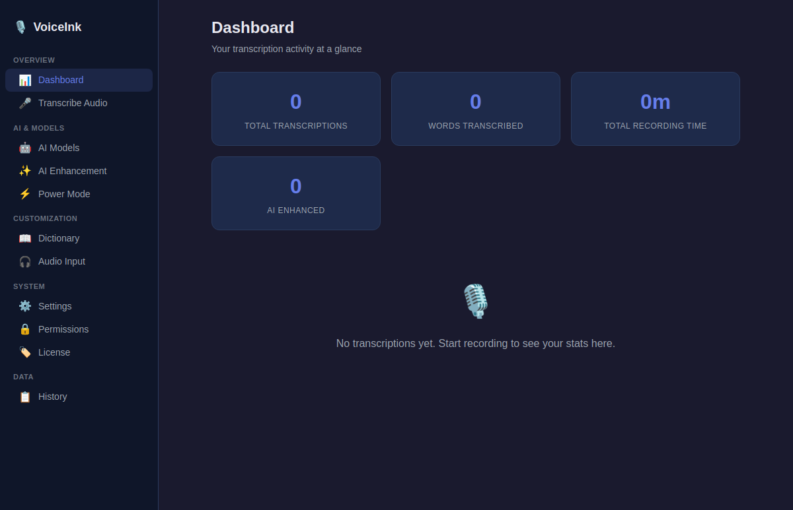

#### UI Elements Comparison

| Element | Swift Original | Electron Version | Status |
|---------|---------------|-----------------|--------|
| **Trial message banner** | Conditional TrialMessageView (warning/info states) | Not implemented | ❌ Missing |
| **Trial expiry countdown** | Shows remaining days, color-coded | Not implemented | ❌ Missing |
| **"Add License Key" button** | Posts navigateToDestination notification | Not implemented | ❌ Missing |
| **Metric cards** | MetricsContent component (separate file) | 4 cards in grid layout | ⚠️ Partial |
| **Total Transcriptions** | Part of MetricsContent | ✅ Displayed | ✅ Match |
| **Words Transcribed** | Part of MetricsContent | ✅ Formatted with locale | ✅ Match |
| **Total Recording Time** | Part of MetricsContent | ✅ Formatted as Xh Ym | ✅ Match |
| **AI Enhanced count** | Part of MetricsContent | ✅ Counts enhanced items | ✅ Match |
| **Empty state** | Part of MetricsContent | 🎙️ + message text | ✅ Match |
| **MetricsSetupView** | Initial setup component | Not implemented | ❌ Missing |
| **PerformanceAnalysisView** | Analysis sheet for selected items | Not implemented | ❌ Missing |
| **DashboardPromotionsSection** | Promotional content | Not implemented | ❌ Missing |
| **HelpAndResourcesSection** | Help links | Not implemented | ❌ Missing |

#### Interaction Comparison

| Interaction | Swift | Electron | Status |
|-------------|-------|----------|--------|
| Loading state | Not explicitly shown | Shows "Loading..." text | ✅ Improved |
| Navigate to license | Button posts notification | Not available | ❌ Missing |
| Metric calculation | From ModelContext query | From IPC transcriptions.list() | ✅ Equivalent |

---

### 4.2 Settings View

**Electron Screenshot:**

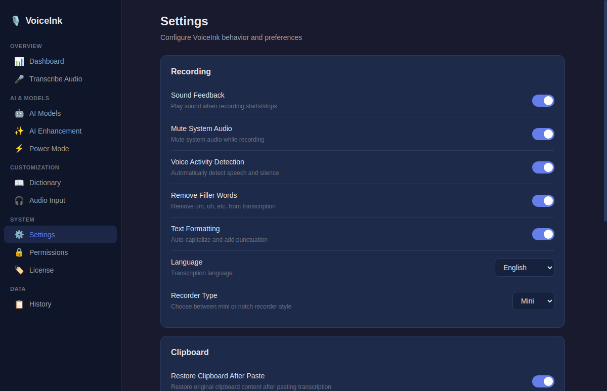

#### UI Elements Comparison

| Setting Section | Swift Element | Electron Element | Status |
|----------------|--------------|-----------------|--------|
| **Shortcuts Section** | | | |
| Shortcut 1 (Hotkey) | HotkeyModePicker + HotkeyPicker + Recorder | Not implemented | ❌ Missing |
| Shortcut 2 (Hotkey) | Conditional with minus button | Not implemented | ❌ Missing |
| "Add Second Shortcut" button | Conditional display | Not implemented | ❌ Missing |
| **Additional Shortcuts** | | | |
| Paste Last (Original) | KeyboardShortcuts.Recorder | Not implemented | ❌ Missing |
| Paste Last (Enhanced) | KeyboardShortcuts.Recorder | Not implemented | ❌ Missing |
| Retry Last Transcription | KeyboardShortcuts.Recorder | Not implemented | ❌ Missing |
| Custom Cancel Shortcut | ExpandableSettingsRow | Not implemented | ❌ Missing |
| Middle-Click Recording | ExpandableSettingsRow + TextField | Not implemented | ❌ Missing |
| **Recording Feedback** | | | |
| Sound Feedback | ExpandableSettingsRow → CustomSoundSettingsView | Toggle (simplified) | ⚠️ Simplified |
| Mute Audio While Recording | Picker (0-5s delay) | Toggle (no delay picker) | ⚠️ Simplified |
| Restore Clipboard After Paste | Picker (250ms-5s) | Toggle + Number input (0.5-10s) | ⚠️ Different control |
| Use AppleScript Paste | Toggle | Not implemented (macOS-specific) | ❌ N/A on Windows |
| **Voice Activity Detection** | Not in SettingsView (in recorder) | Toggle in Settings | ⚠️ Relocated |
| **Remove Filler Words** | FillerWordsSettingsView | Toggle in Settings | ⚠️ Simplified |
| **Text Formatting** | Not explicitly in SettingsView | Toggle in Settings | ⚠️ New addition |
| **Language** | LanguageSelectionView (separate) | Dropdown (10 languages) | ⚠️ Simplified |
| **Recorder Type** | Picker (Notch/Mini, segmented) | Dropdown (mini/notch) | ✅ Similar |
| **Power Mode Section** | PowerModeSection component | Not implemented | ❌ Missing |
| **Interface** | Recorder Style picker | Recorder Type dropdown | ✅ Similar |
| **Experimental** | ExperimentalSection | Not implemented | ❌ Missing |
| **General** | | | |
| Hide Dock Icon | Toggle | Menu Bar Only Mode toggle | ✅ Renamed |
| Launch at Login | LaunchAtLogin.Toggle | Not implemented | ❌ Missing |
| Auto Check Updates | Toggle | Toggle | ✅ Match |
| Show Announcements | Toggle | Not implemented | ❌ Missing |
| Check for Updates button | Button | Not implemented | ❌ Missing |
| Reset Onboarding button | Button with alert | Not implemented | ❌ Missing |
| **Privacy** | AudioCleanupSettingsView | Auto Cleanup card | ⚠️ Simplified |
| Auto-Delete Transcriptions | Part of AudioCleanup | Toggle + retention input | ✅ Similar |
| Auto-Delete Audio Files | Part of AudioCleanup | Toggle + retention input | ✅ Similar |
| **Backup** | | | |
| Export Settings | Button | Not implemented | ❌ Missing |
| Import Settings | Button | Not implemented | ❌ Missing |
| **Diagnostics** | DiagnosticsSettingsView | Not implemented | ❌ Missing |

#### Summary: Settings View

- **Swift**: ~25+ settings across 10 sections with expandable rows, grouped form, pickers, recorders
- **Electron**: ~14 settings across 4 cards with toggles, dropdowns, and number inputs
- **Coverage**: ~40% of settings implemented, most shortcut/advanced features missing

---

### 4.3 Transcription History View

**Electron Screenshot:**

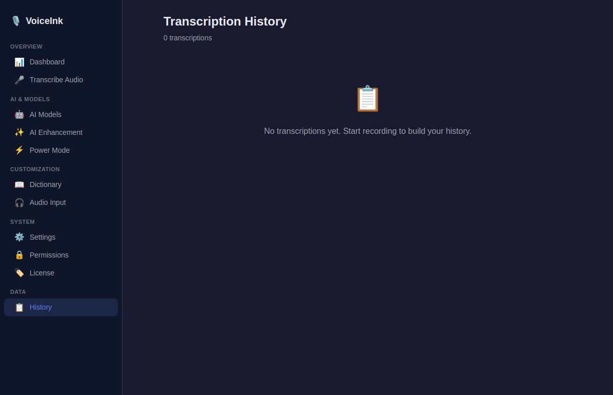

#### UI Elements Comparison

| Element | Swift Original | Electron Version | Status |
|---------|---------------|-----------------|--------|
| **Layout** | 3-column (list + detail + metadata) | Single list view | ❌ Major simplification |
| **Search bar** | TextField with magnifyingglass icon | Not implemented | ❌ Missing |
| **Left sidebar** | Scrollable list (200-350pt width) | Full-width list | ⚠️ Simplified |
| **Center pane** | TranscriptionDetailView | Expandable inline | ⚠️ Different pattern |
| **Right sidebar** | TranscriptionMetadataView | Inline metadata | ⚠️ Different pattern |
| **Sidebar toggles** | Toolbar buttons to show/hide sidebars | Not applicable | ❌ N/A |
| **Selection checkbox** | Multi-select checkboxes | Single-select click | ⚠️ Simplified |
| **List items** | TranscriptionListItem component | History item cards | ✅ Similar |
| **Pagination** | "Load More" button (pageSize: 20) | Full list (no pagination) | ❌ Missing |
| **Selection toolbar** | Bottom sticky bar | Not implemented | ❌ Missing |
| **"Select All" / "Deselect All"** | Toggle button | Not implemented | ❌ Missing |
| **Analyze button** | Chart icon, PerformanceAnalysisView | Not implemented | ❌ Missing |
| **Export button** | Arrow icon, CSV export | Not implemented | ❌ Missing |
| **Bulk Delete** | Trash icon with confirmation alert | Not implemented | ❌ Missing |
| **Selected count** | "X selected" display | Not implemented | ❌ Missing |
| **Empty state** | Doc icon + text | 📋 + text | ✅ Similar |
| **Sidebar animations** | .move(edge:) transitions | Not implemented | ❌ Missing |
| **Copy action** | Via TranscriptionDetailView | ✅ 📋 Copy button | ✅ Implemented |
| **Delete action** | Via selection toolbar | ✅ 🗑️ Delete button | ✅ Implemented |
| **Text display** | Full text in detail pane | 2-line clamp with ellipsis | ⚠️ Truncated |
| **Metadata display** | Full metadata sidebar | Inline date, duration, model | ⚠️ Simplified |
| **Power mode info** | In metadata | ⚡ emoji + name (conditional) | ✅ Implemented |

#### Key Differences

1. **Swift**: Professional 3-column layout with search, multi-select, bulk operations, pagination
2. **Electron**: Simple single-column list with individual item actions
3. **Missing**: Search, multi-select, bulk operations, pagination, analysis, CSV export

---

### 4.4 Dictionary Settings View

**Electron Screenshot:**

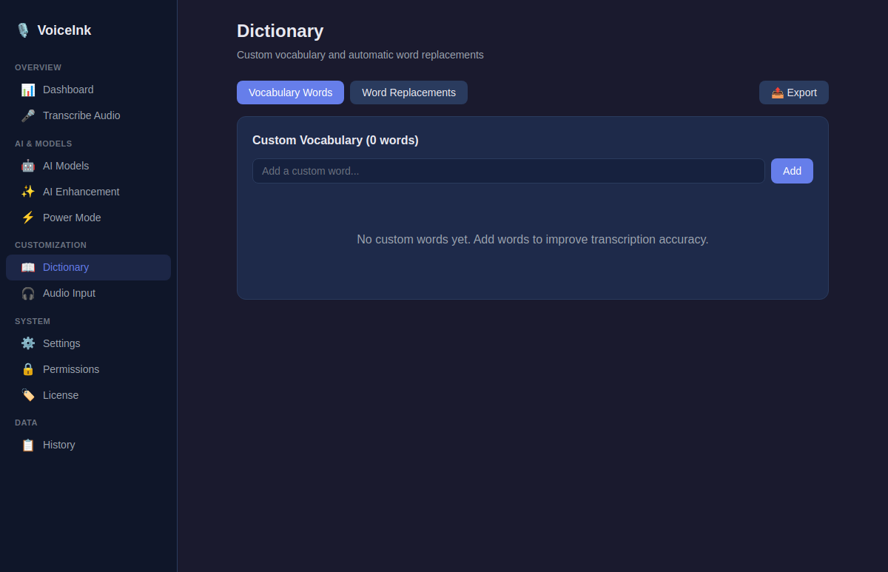

#### UI Elements Comparison

| Element | Swift Original | Electron Version | Status |
|---------|---------------|-----------------|--------|
| **Hero section** | CompactHeroSection with brain icon | View header with title/subtitle | ⚠️ Simplified |
| **Section selector** | Two SectionCard buttons with icons | Two tab buttons | ⚠️ Simplified |
| **Import button** | Square.and.arrow.down icon (blue) | Not implemented | ❌ Missing |
| **Export button** | Square.and.arrow.up icon (blue) | 📤 Export button | ✅ Implemented |
| **Vocabulary tab** | VocabularyView component | Word tags with add/delete | ✅ Implemented |
| **Word input** | Part of VocabularyView | Text input + Add button | ✅ Implemented |
| **Word display** | Part of VocabularyView | Flex-wrapped tags with ✕ | ✅ Implemented |
| **Replacements tab** | WordReplacementView component | Two inputs + arrow + list | ✅ Implemented |
| **Original input** | Part of WordReplacementView | Text field | ✅ Implemented |
| **Replacement input** | Part of WordReplacementView | Text field with Enter support | ✅ Implemented |
| **Rule display** | Part of WordReplacementView | original → replacement format | ✅ Implemented |
| **Edit replacement** | EditReplacementSheet | Not implemented | ❌ Missing |
| **CardBackground** | Custom component with selection state | CSS card styling | ⚠️ Simplified |
| **Import from file** | File picker dialog | Not implemented | ❌ Missing |

#### Summary: Dictionary View

- **Swift**: Rich hero section, card-based section selector, import/export, edit sheet
- **Electron**: Functional tab-based view with add/delete/export
- **Coverage**: ~70% of core functionality implemented, import and edit missing

---

### 4.5 AI Models Management View

**Electron Screenshot:**

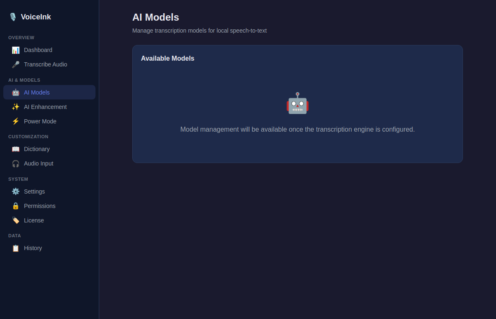

#### UI Elements Comparison

| Element | Swift Original | Electron Version | Status |
|---------|---------------|-----------------|--------|
| **Intel Mac warning** | Conditional banner with "Use Cloud" button | Not applicable (cross-platform) | N/A |
| **Default Model section** | Headline + current model name display | Not implemented | ❌ Missing |
| **Language selection** | LanguageSelectionView component | Not implemented | ❌ Missing |
| **Filter tabs** | Recommended / Local / Cloud / Custom pill buttons | Not implemented | ❌ Missing |
| **Model cards** | LazyVStack with ModelCardRowView components | Not implemented | ❌ Missing |
| **Download button** | Per-card download action | Not implemented | ❌ Missing |
| **Delete button** | Per-card with confirmation alert | Not implemented | ❌ Missing |
| **Set Default button** | Per-card action | Not implemented | ❌ Missing |
| **Edit button** | Per-card for custom models | Not implemented | ❌ Missing |
| **Import Local Model** | NSOpenPanel for .bin files | Not implemented | ❌ Missing |
| **Add Custom Model** | AddCustomModelCardView | Not implemented | ❌ Missing |
| **Model Settings** | Gear icon toggle → ModelSettingsView | Not implemented | ❌ Missing |
| **Warming indicator** | Shows for pre-loading local models | Not implemented | ❌ Missing |
| **Card types** | Cloud, Local, Native, Parakeet, Custom variants | Not implemented | ❌ Missing |
| **Filter animation** | Spring animation on tab switch | Not implemented | ❌ Missing |
| **Placeholder** | N/A | "AI Models management coming soon" text | ⚠️ Stub only |

#### Summary: AI Models View

- **Swift**: Full model management with 5 card types, 4 filter categories, download/delete/import
- **Electron**: Placeholder text only
- **Coverage**: ~0% implemented

---

### 4.6 AI Enhancement View

**Electron Screenshot:**

#### UI Elements Comparison

| Element | Swift Original | Electron Version | Status |
|---------|---------------|-----------------|--------|
| **Enable Enhancement toggle** | Toggle with InfoTip link | Toggle switch | ⚠️ No info tip |
| **Clipboard Context toggle** | Toggle with InfoTip | Not implemented | ❌ Missing |
| **Screen Context toggle** | Toggle with InfoTip | Not implemented | ❌ Missing |
| **API Key Management** | APIKeyManagementView (full component) | Not implemented | ❌ Missing |
| **Enhancement Prompts grid** | ReorderablePromptGrid (drag-reorder) | "Coming soon" placeholder | ❌ Missing |
| **Prompt icons** | Custom icons with selection/edit/delete | Not implemented | ❌ Missing |
| **Drag-to-reorder** | Visual feedback with opacity/scale changes | Not implemented | ❌ Missing |
| **Double-click to edit** | Opens PromptEditorView | Not implemented | ❌ Missing |
| **Right-click context menu** | More options | Not implemented | ❌ Missing |
| **Add prompt button** | plus.circle.fill icon | Not implemented | ❌ Missing |
| **Shortcuts section** | DisclosureGroup → EnhancementShortcutsView | Not implemented | ❌ Missing |
| **Right-sliding panel** | PromptEditorView (450pt width) | Not implemented | ❌ Missing |
| **Panel overlay** | Semi-transparent backdrop with blur | Not implemented | ❌ Missing |
| **Panel animation** | Spring animation (0.4 response, 0.9 damping) | Not implemented | ❌ Missing |
| **Conditional opacity** | Sections dim when enhancement disabled | Not implemented | ❌ Missing |
| **AI Provider card** | N/A | "Coming soon" placeholder | ⚠️ Stub |
| **Enhancement Prompts card** | N/A | "Coming soon" placeholder | ⚠️ Stub |

#### Summary: AI Enhancement View

- **Swift**: Full-featured enhancement configuration with API keys, prompts, drag-reorder, editor panel
- **Electron**: Toggle only + two placeholder cards
- **Coverage**: ~5% implemented

---

### 4.7 Mini Recorder View

**Electron Screenshot:**

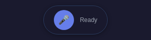

#### UI Elements Comparison

| Element | Swift Original | Electron Version | Status |
|---------|---------------|-----------------|--------|
| **Container shape** | Black rounded rectangle (184×40pt, 20pt radius) | Pill shape (rounded 32px, semi-transparent dark) | ⚠️ Different styling |
| **Width** | 184pt fixed | Flexible content width | ⚠️ Different |
| **Height** | 40pt fixed | Flexible (via padding) | ⚠️ Different |
| **Background** | Solid black | rgba(26,26,46,0.95) + blur(20px) | ⚠️ Different (translucent) |
| **Prompt button** | RecorderPromptButton (left, 22pt icon) | Not implemented | ❌ Missing |
| **Status display** | RecorderStatusDisplay (center) | Status text span | ⚠️ Simplified |
| **Power Mode button** | RecorderPowerModeButton (right, 22pt icon) | Not implemented | ❌ Missing |
| **Audio visualizer** | Via recorder.audioMeter | 5 animated bars | ✅ Implemented |
| **Record button** | Part of RecorderComponents | 🎤/⏹/⏳ circular button (40px) | ✅ Implemented |
| **Recording state** | RecorderStateProvider | 4 states (idle/recording/transcribing/enhancing) | ✅ Implemented |
| **Pulse animation** | Not visible in view code | CSS keyframes scale(1)→scale(1.05) | ✅ Implemented |
| **Prompt popover** | ActivePopoverState management | Not implemented | ❌ Missing |
| **Power mode popover** | ActivePopoverState management | Not implemented | ❌ Missing |
| **Notch variant** | NotchRecorderView (alternative style) | Not implemented | ❌ Missing |
| **Window behavior** | MiniRecorderPanel (always-on-top, NSPanel) | BrowserWindow (separate) | ⚠️ Partial |
| **Audio level bars** | From recorder.audioMeter binding | From IPC onAudioLevel callback | ✅ Equivalent |
| **Bar height formula** | Not visible (in RecorderComponents) | Math.max(4, avgPower * 24 * variance) | ✅ Implemented |

#### Summary: Mini Recorder View

- **Swift**: Compact recorder with prompt/power mode buttons, popovers, notch variant
- **Electron**: Core recording UI with button, visualizer, state management
- **Coverage**: ~50% of core functionality implemented

---

### 4.8 Transcribe Audio View

**Electron Screenshot:**

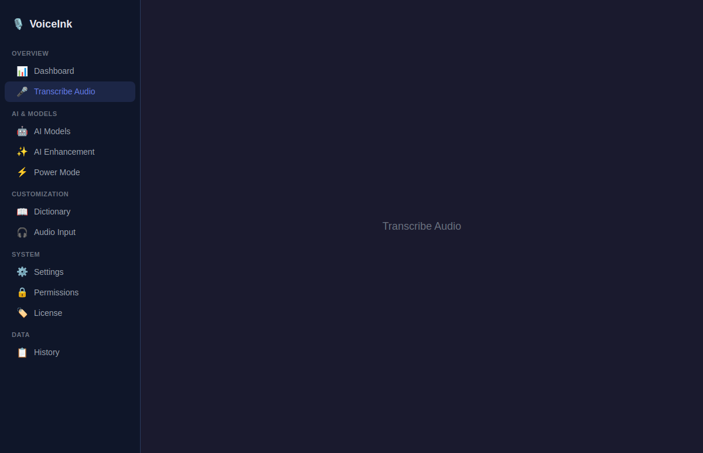

#### UI Elements Comparison

| Element | Swift Original | Electron Version | Status |
|---------|---------------|-----------------|--------|
| **Drop zone** | Rounded rect with dashed border, animated color | Not implemented | ❌ Missing |
| **Drag-over animation** | Blue/gray border color change | Not implemented | ❌ Missing |
| **"Drop audio or video file here"** | Headline text | Not implemented | ❌ Missing |
| **"Choose File" button** | Bordered style button | Not implemented | ❌ Missing |
| **Supported formats list** | WAV, MP3, M4A, AIFF, MP4, MOV, etc. | Not implemented | ❌ Missing |
| **Processing view** | ProgressView with phase message | Not implemented | ❌ Missing |
| **File selected state** | Filename display + enhancement toggle + prompt picker | Not implemented | ❌ Missing |
| **AI Enhancement toggle** | Switch style with onChange | Not implemented | ❌ Missing |
| **Prompt selection** | Picker for available prompts | Not implemented | ❌ Missing |
| **"Start Transcription" button** | borderedProminent style | Not implemented | ❌ Missing |
| **"Choose Different File" button** | bordered style | Not implemented | ❌ Missing |
| **TranscriptionResultView** | Shows result below divider | Not implemented | ❌ Missing |
| **Error alert** | Shows transcriptionManager.errorMessage | Not implemented | ❌ Missing |
| **Placeholder** | N/A | "Transcribe Audio coming soon" text | ⚠️ Stub only |

#### Summary: Transcribe Audio View

- **Swift**: Full audio file transcription with drag-drop, format validation, enhancement, results
- **Electron**: Placeholder text only
- **Coverage**: 0% implemented

---

### 4.9 Power Mode View

**Electron Screenshot:**

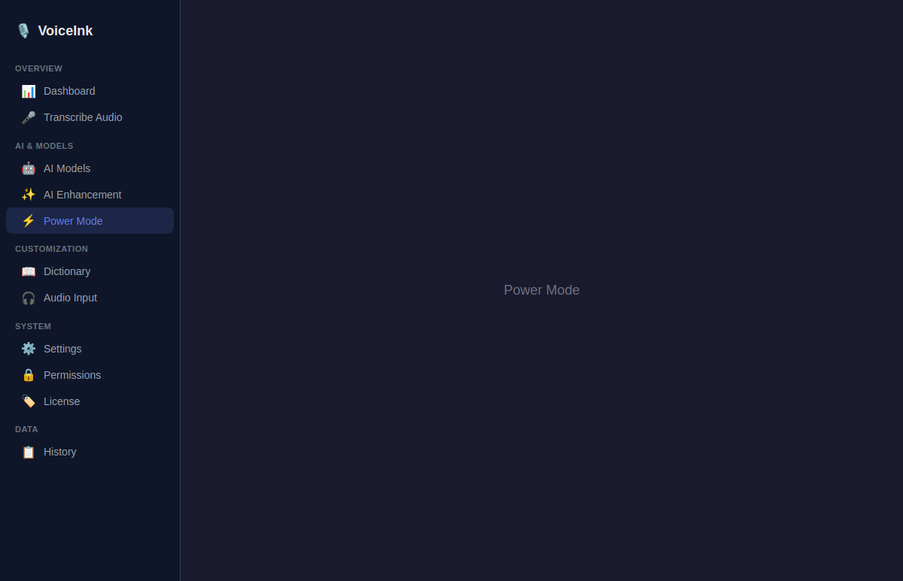

#### UI Elements Comparison

| Element | Swift Original | Electron Version | Status |
|---------|---------------|-----------------|--------|
| **Header** | "Power Modes" (28pt bold) + InfoTip + subtitle | Not implemented | ❌ Missing |
| **"Add Power Mode" button** | Plus icon + text, accent background | Not implemented | ❌ Missing |
| **Reorder toggle** | "Reorder"/"Done" button | Not implemented | ❌ Missing |
| **Empty state** | Grid icon (48pt) + "No Power Modes Yet" text | Not implemented | ❌ Missing |
| **Configuration grid** | PowerModeConfigurationsGrid component | Not implemented | ❌ Missing |
| **Reorder mode list** | Drag-to-reorder list with emoji circles | Not implemented | ❌ Missing |
| **Status badges** | "Default" (accent) / "Disabled" (outline) | Not implemented | ❌ Missing |
| **NavigationStack** | Path-based navigation to ConfigurationView | Not implemented | ❌ Missing |
| **Config editing** | Full ConfigurationView for add/edit | Not implemented | ❌ Missing |
| **App detection** | ActiveWindowService, AppPicker | Not implemented | ❌ Missing |
| **Browser URL detection** | BrowserURLService | Not implemented | ❌ Missing |
| **Emoji picker** | EmojiManager + EmojiPickerView | Not implemented | ❌ Missing |
| **Shortcut management** | PowerModeShortcutManager | Not implemented | ❌ Missing |
| **Placeholder** | N/A | "Power Mode coming soon" text | ⚠️ Stub only |

#### Summary: Power Mode View

- **Swift**: Complete context-aware automation system with 15+ files, app detection, emoji picker
- **Electron**: Placeholder text only
- **Coverage**: 0% implemented

---

### 4.10 Permissions View

**Electron Screenshot:**

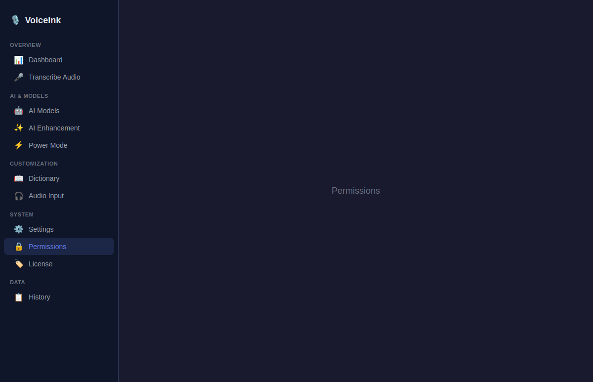

#### UI Elements Comparison

| Element | Swift Original | Electron Version | Status |
|---------|---------------|-----------------|--------|
| **Hero section** | CompactHeroSection (shield icon, title, description) | Not implemented | ❌ Missing |
| **Keyboard Shortcut card** | Permission card with configure button | Not implemented | ❌ Missing |
| **Microphone Access card** | Permission card with request/settings button | Not implemented | ❌ Missing |
| **Accessibility Access card** | Permission card with InfoTip | Not implemented | ❌ Missing |
| **Screen Recording card** | Permission card with InfoTip + docs link | Not implemented | ❌ Missing |
| **Status indicators** | Green checkmark / Orange xmark (20pt, animated) | Not implemented | ❌ Missing |
| **Refresh button** | Rotating animation during check | Not implemented | ❌ Missing |
| **Permission cards** | HStack with icon circle, title, description, status | Not implemented | ❌ Missing |
| **Action buttons** | Gradient accent background, arrow icon | Not implemented | ❌ Missing |
| **PermissionManager** | Observes system permission states | Not implemented | ❌ Missing |
| **Placeholder** | N/A | "Permissions coming soon" text | ⚠️ Stub only |

#### Summary: Permissions View

- **Swift**: 4 permission cards with live status, request/navigate actions
- **Electron**: Placeholder text only
- **Coverage**: 0% implemented

---

### 4.11 Audio Input View

**Electron Screenshot:**

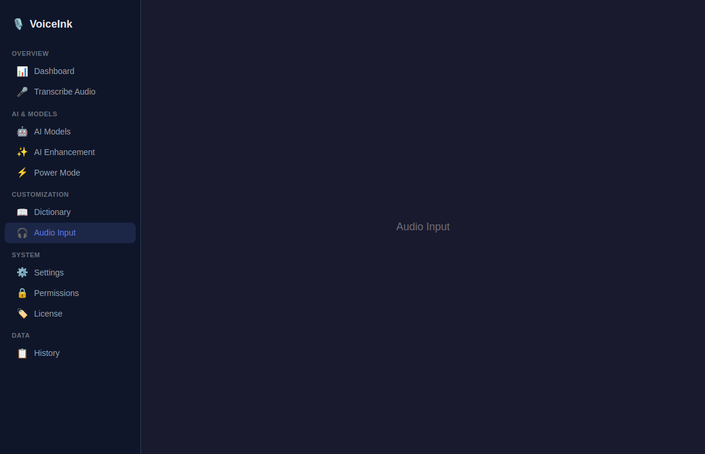

#### UI Elements Comparison

| Element | Swift Original | Electron Version | Status |
|---------|---------------|-----------------|--------|
| **Audio device list** | AudioDeviceManager lists available devices | Not implemented | ❌ Missing |
| **Device selection** | Click to select input device | Not implemented | ❌ Missing |
| **Current device indicator** | Checkmark on selected device | Not implemented | ❌ Missing |
| **Audio level meter** | Real-time input level visualization | Not implemented | ❌ Missing |
| **Device configuration** | AudioDeviceConfiguration settings | Not implemented | ❌ Missing |
| **Placeholder** | N/A | "Audio Input coming soon" text | ⚠️ Stub only |

#### Summary: Audio Input View

- **Swift**: AudioInputSettingsView with device listing and configuration
- **Electron**: Placeholder text only
- **Coverage**: 0% implemented

---

### 4.12 License / VoiceInk Pro View

**Electron Screenshot:**

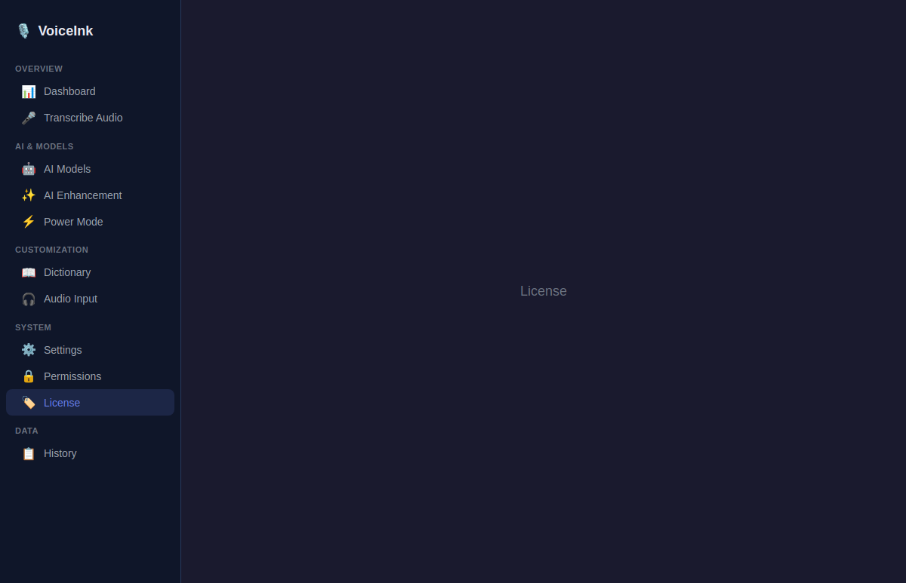

#### UI Elements Comparison

| Element | Swift Original | Electron Version | Status |
|---------|---------------|-----------------|--------|
| **License key input** | Text field for key entry | Not implemented | ❌ Missing |
| **Activate button** | Validates and activates license | Not implemented | ❌ Missing |
| **License status** | Shows active/trial/expired state | Not implemented | ❌ Missing |
| **PRO badge** | White text on blue background | Not implemented | ❌ Missing |
| **Feature comparison** | Free vs. Pro features table | Not implemented | ❌ Missing |
| **Subscription management** | LicenseManagementView | Not implemented | ❌ Missing |
| **Polar integration** | PolarService for license validation | Not implemented | ❌ Missing |
| **Trial management** | Remaining days, expiration warnings | Not implemented | ❌ Missing |
| **Placeholder** | N/A | "License coming soon" text | ⚠️ Stub only |

#### Summary: License View

- **Swift**: Full license management with validation, subscription, trial system
- **Electron**: Placeholder text only
- **Coverage**: 0% implemented

---

### 4.13 Menu Bar / System Tray

#### UI Elements Comparison

| Element | Swift MenuBarView | Electron TrayManager | Status |
|---------|------------------|---------------------|--------|
| **Toggle Recorder** | Button | "Toggle Recorder" menu item | ✅ Similar |
| **Retry Last Transcription** | Button | Not implemented | ❌ Missing |
| **Copy Last Transcription** | Cmd+Shift+C shortcut | Not implemented | ❌ Missing |
| **History** | Cmd+Shift+H shortcut | Not implemented | ❌ Missing |
| **Settings** | Cmd+, shortcut | "Settings" menu item (opens window) | ⚠️ No shortcut |
| **Show/Hide Dock Icon** | Cmd+Shift+D toggle | Not implemented | ❌ Missing |
| **Check for Updates** | Button | Not implemented | ❌ Missing |
| **Help and Support** | Button | Not implemented | ❌ Missing |
| **Quit VoiceInk** | Button | "Quit" menu item | ✅ Implemented |
| **AI Enhancement toggle** | Toggle with state | Not implemented | ❌ Missing |
| **Launch at Login toggle** | Toggle | Not implemented | ❌ Missing |
| **Transcription Model menu** | Submenu with model list + checkmark | Not implemented | ❌ Missing |
| **Prompt Selection menu** | Submenu with prompt list + checkmark | Not implemented | ❌ Missing |
| **AI Provider menu** | Submenu with provider list | Not implemented | ❌ Missing |
| **AI Model menu** | Submenu with model list | Not implemented | ❌ Missing |
| **Language Selection** | LanguageSelectionView submenu | Not implemented | ❌ Missing |
| **Audio Input menu** | Submenu with device list + checkmark | Not implemented | ❌ Missing |
| **Clipboard Context toggle** | In Additional menu | Not implemented | ❌ Missing |
| **Context Awareness toggle** | In Additional menu | Not implemented | ❌ Missing |
| **Menu separators** | Dividers between sections | Single separator | ⚠️ Minimal |

#### Summary: Menu Bar / System Tray

- **Swift**: Rich menu with 15+ items, 5 submenus, shortcuts, toggles
- **Electron**: 3 items (Toggle Recorder, Settings, Quit) with separator
- **Coverage**: ~15% implemented

---

### 4.14 Onboarding Flow

#### UI Elements Comparison

| Element | Swift Original | Electron Version | Status |
|---------|---------------|-----------------|--------|
| **Welcome screen** | "Welcome to the Future of Typing" with animated background | Not implemented | ❌ Missing |
| **Animated glow** | Accent color circle with 2s animation | Not implemented | ❌ Missing |
| **Particle system** | 60 particles, 0.2 opacity | Not implemented | ❌ Missing |
| **Typewriter animation** | Role cycling with type/delete speeds | Not implemented | ❌ Missing |
| **"Get Started" button** | White, 200pt, ScaleButtonStyle | Not implemented | ❌ Missing |
| **"Skip Tour" button** | White 0.2 opacity text | Not implemented | ❌ Missing |
| **Permissions screen** | OnboardingPermissionsView | Not implemented | ❌ Missing |
| **Tutorial screen** | OnboardingTutorialView | Not implemented | ❌ Missing |
| **Model download** | OnboardingModelDownloadView | Not implemented | ❌ Missing |
| **Screen transitions** | .move(edge:) + .opacity combined | Not implemented | ❌ Missing |

#### Summary: Onboarding Flow

- **Swift**: 4-step animated onboarding with particles, typewriter, permissions, model download
- **Electron**: Not implemented
- **Coverage**: 0% implemented

---

## 5. Service Layer Comparison

### Services Implementation Status

| # | Swift Service | Purpose | Electron Equivalent | Status |
|---|--------------|---------|-------------------|--------|
| 1 | **UserDefaultsManager** | App preferences storage | SettingsService (JSON file) | ✅ Implemented |
| 2 | **CustomVocabularyService** | Vocabulary word management | DictionaryService (combined) | ✅ Implemented |
| 3 | **WordReplacementService** | Word replacement rules | DictionaryService (combined) | ✅ Implemented |
| 4 | **DictionaryImportExportService** | Dictionary import/export | DictionaryService.export() | ⚠️ Partial (export only) |
| 5 | **TranscriptionService** | Core transcription orchestration | Not implemented | ❌ Missing |
| 6 | **LocalTranscriptionService** | Local model inference | Not implemented | ❌ Missing |
| 7 | **NativeAppleTranscriptionService** | macOS native Speech | Not applicable (macOS only) | N/A |
| 8 | **CloudTranscriptionService** | Cloud provider abstraction | Not implemented | ❌ Missing |
| 9 | **OpenAICompatibleTranscriptionService** | OpenAI API calls | Not implemented | ❌ Missing |
| 10 | **AudioFileTranscriptionService** | Batch audio file processing | Not implemented | ❌ Missing |
| 11 | **StreamingTranscriptionService** | Real-time streaming | Not implemented | ❌ Missing |
| 12 | **DeepgramStreamingProvider** | Deepgram streaming | Not implemented | ❌ Missing |
| 13 | **ElevenLabsStreamingProvider** | ElevenLabs streaming | Not implemented | ❌ Missing |
| 14 | **MistralStreamingProvider** | Mistral streaming | Not implemented | ❌ Missing |
| 15 | **ParakeetStreamingProvider** | Parakeet streaming | Not implemented | ❌ Missing |
| 16 | **SonioxStreamingProvider** | Soniox streaming | Not implemented | ❌ Missing |
| 17 | **AIEnhancementService** | Text enhancement post-processing | Not implemented | ❌ Missing |
| 18 | **AIService** | AI provider interface | Not implemented | ❌ Missing |
| 19 | **AIEnhancementOutputFilter** | Output filtering | Not implemented | ❌ Missing |
| 20 | **Recorder** | Audio recording management | IPC stubs (no actual recording) | ⚠️ Stubs only |
| 21 | **CoreAudioRecorder** | Low-level audio capture | Not implemented | ❌ Missing |
| 22 | **PlaybackController** | Audio playback | Not implemented | ❌ Missing |
| 23 | **SoundManager** | Sound effects | Not implemented | ❌ Missing |
| 24 | **ClipboardManager** | Clipboard operations | Not implemented | ❌ Missing |
| 25 | **CursorPaster** | Text insertion at cursor | Not implemented | ❌ Missing |
| 26 | **HotkeyManager** | Global keyboard shortcuts | Not implemented | ❌ Missing |
| 27 | **AudioDeviceManager** | Audio device listing/selection | Not implemented | ❌ Missing |
| 28 | **WhisperModelManager** | Whisper model download/management | Not implemented | ❌ Missing |
| 29 | **TranscriptionModelManager** | Model registry | Not implemented | ❌ Missing |
| 30 | **ParakeetModelManager** | Parakeet model management | Not implemented | ❌ Missing |
| 31 | **VADModelManager** | Voice Activity Detection | Not implemented | ❌ Missing |
| 32 | **ModelPrewarmService** | Pre-load models | Not implemented | ❌ Missing |
| 33 | **VoiceInkEngine** | Main Whisper engine | Not implemented | ❌ Missing |
| 34 | **TranscriptionPipeline** | Processing pipeline | Not implemented | ❌ Missing |
| 35 | **KeychainService** | Secure credential storage | Not implemented | ❌ Missing |
| 36 | **APIKeyManager** | API key management | Not implemented | ❌ Missing |
| 37 | **CustomModelManager** | Custom model CRUD | Not implemented | ❌ Missing |
| 38 | **ScreenCaptureService** | Screenshot for context | Not implemented | ❌ Missing |
| 39 | **SelectedTextService** | Get selected text from OS | Not implemented | ❌ Missing |
| 40 | **BrowserURLService** | Extract browser URL | Not implemented | ❌ Missing |
| 41 | **PromptDetectionService** | Auto-select prompt | Not implemented | ❌ Missing |
| 42 | **FillerWordManager** | Remove filler words | Not implemented | ❌ Missing |
| 43 | **TranscriptionOutputFilter** | Post-processing | Not implemented | ❌ Missing |
| 44 | **TranscriptionAutoCleanupService** | Auto-delete old transcriptions | Not implemented | ❌ Missing |
| 45 | **LicenseManager** | License validation | Not implemented | ❌ Missing |
| 46 | **PolarService** | Polar.sh integration | Not implemented | ❌ Missing |
| 47 | **AnnouncementsService** | In-app announcements | Not implemented | ❌ Missing |
| 48 | **ImportExportService** | Settings import/export | Not implemented | ❌ Missing |
| 49 | **LogExporter** | Diagnostics export | Not implemented | ❌ Missing |
| 50 | **OllamaService** | Ollama local AI | Not implemented | ❌ Missing |
| 51 | **DictionaryMigrationService** | Schema migration | Not implemented | ❌ Missing |
| 52 | **MediaController** | Media key handling | Not implemented | ❌ Missing |
| 53 | **EmailSupport** | Email support link | Not implemented | ❌ Missing |

### Summary: Service Layer

- **Implemented**: 3 of 53 services (SettingsService, DictionaryService, TranscriptionStore)
- **Partially implemented**: 2 (Recorder IPC stubs, DictionaryImport/Export)
- **Coverage**: ~6%

---

## 6. Data Model Comparison

| # | Swift Model | Fields | Electron Model | Status |
|---|------------|--------|---------------|--------|
| 1 | **Transcription** | id, text, enhancedText, timestamp, duration, modelUsed, powerModeName, powerModeEmoji, audioFilePath | **Transcription** (id, text, enhancedText, timestamp, duration, modelUsed, powerModeName, powerModeEmoji) | ⚠️ Missing audioFilePath |
| 2 | **VocabularyWord** | id, word, createdAt | **VocabularyWord** (id, word, createdAt) | ✅ Match |
| 3 | **WordReplacement** | id, original, replacement, createdAt, isEnabled | **WordReplacement** (id, original, replacement, createdAt, isEnabled) | ✅ Match |
| 4 | **TranscriptionModel** | id, name, provider, size, isDownloaded, etc. | Not implemented | ❌ Missing |
| 5 | **CustomPrompt** | id, title, icon, prompt, isDefault, order | Not implemented | ❌ Missing |
| 6 | **PredefinedPrompts** | Static prompt definitions | Not implemented | ❌ Missing |
| 7 | **PromptTemplates** | Template strings | Not implemented | ❌ Missing |
| 8 | **AIPrompts** | AI prompt configurations | Not implemented | ❌ Missing |
| 9 | **PredefinedModels** | Model definitions with metadata | Not implemented | ❌ Missing |
| 10 | **LicenseViewModel** | License state management | Not implemented | ❌ Missing |

### Summary: Data Models

- **Implemented**: 3 of 10 models
- **Coverage**: ~30%

---

## 7. IPC & Communication Comparison

### IPC Channel Coverage

| Category | Swift (NotificationCenter / Direct) | Electron IPC Channels | Status |
|----------|-------------------------------------|----------------------|--------|
| **Settings** | UserDefaults direct access | settings:get, settings:set, settings:getAll, settings:reset | ✅ Implemented |
| **Transcriptions** | SwiftData ModelContext | transcriptions:list, transcriptions:add, transcriptions:delete, transcriptions:clear | ✅ Implemented |
| **Dictionary** | Direct service calls | dictionary:getWords, addWord, deleteWord, getReplacements, addReplacement, deleteReplacement, applyReplacements, export, import | ✅ Implemented |
| **Window** | WindowManager / NSNotification | window:navigate, window:openHistory | ✅ Implemented |
| **Recorder** | Recorder class + NotificationCenter | recorder:toggle, recorder:stateChanged, recorder:audioLevel | ⚠️ Channel defined, no backend |
| **Models** | ModelManager direct calls | Not implemented | ❌ Missing |
| **Enhancement** | AIEnhancementService | Not implemented | ❌ Missing |
| **Hotkeys** | HotkeyManager + CGEvent | Not implemented | ❌ Missing |
| **Audio Devices** | AudioDeviceManager | Not implemented | ❌ Missing |
| **License** | LicenseManager + PolarService | Not implemented | ❌ Missing |
| **Updates** | Sparkle framework | Not implemented | ❌ Missing |
| **Power Mode** | PowerModeSessionManager | Not implemented | ❌ Missing |
| **Clipboard** | ClipboardManager + CursorPaster | Not implemented | ❌ Missing |
| **Screen Capture** | ScreenCaptureService | Not implemented | ❌ Missing |

### Summary: IPC Channels

- **Defined**: 4 complete channel groups (Settings, Transcriptions, Dictionary, Window)
- **Partial**: 1 (Recorder - channels only, no backend)
- **Missing**: 10+ channel groups
- **Coverage**: ~30% of needed channels

---

## 8. Test Coverage Analysis

### Current Unit Tests (Electron)

| Test Suite | Tests | Coverage Area | Status |
|-----------|-------|--------------|--------|
| **settings-service.test.ts** | 18 tests | Default values, get/set, persistence, listeners, reset | ✅ All pass |
| **transcription-store.test.ts** | 20 tests | CRUD, sorting, cleanup, persistence | ✅ All pass |
| **dictionary-service.test.ts** | 22 tests | Vocabulary, replacements, apply, import/export | ✅ All pass |
| **models.test.ts** | 8 tests | Model creation, IDs, overrides | ✅ All pass |
| **ipc-channels.test.ts** | 6 tests | Channel completeness, uniqueness, naming | ✅ All pass |
| **Total** | **74 tests** | | **100% pass** |

### Missing Test Coverage

| Area | Tests Needed | Priority |
|------|-------------|----------|
| Recorder service | State transitions, audio level processing | High |
| Window manager | Window creation, navigation, lifecycle | High |
| Tray manager | Menu creation, click handlers | Medium |
| IPC handlers | Request/response, error handling | High |
| React components | Render, interaction, state changes | High |
| AI Enhancement service | Toggle, provider connection, prompt management | Medium |
| Model management | Download, delete, filter, set default | Medium |
| History view | Search, pagination, multi-select, export | Medium |
| E2E tests | Full user flows | Low (for now) |

### Test Infrastructure Assessment

| Aspect | Status | Notes |
|--------|--------|-------|
| Unit test framework | ✅ Jest | Properly configured with dual environments |
| Node environment tests | ✅ | For main process services |
| JSDOM environment tests | ✅ | For shared models/constants |
| React component tests | ❌ | @testing-library/react installed but unused |
| E2E test framework | ❌ | Not set up (Playwright/Spectron) |
| Test coverage reporting | ✅ | jest --coverage configured |
| CI integration | ❌ | No GitHub Actions workflow |

---

## 9. Cross-Platform Compatibility Analysis

### Platform-Specific Feature Mapping

| Swift Feature | macOS API | Windows Equivalent | Electron API | Status |
|--------------|-----------|-------------------|-------------|--------|
| **Menu bar icon** | NSStatusItem | System tray | Tray | ✅ Implemented |
| **Global hotkeys** | CGEvent / HotKey | RegisterHotKey | globalShortcut | ❌ Not implemented |
| **Accessibility paste** | AXUIElement / AppleScript | SendInput / clipboard | clipboard + robot | ❌ Not implemented |
| **Screen capture** | CGWindowListImage | PrintWindow / BitBlt | desktopCapturer | ❌ Not implemented |
| **Audio recording** | CoreAudio / AVAudioRecorder | WASAPI / MediaRecorder | navigator.mediaDevices | ❌ Not implemented |
| **Audio devices** | AVCaptureDevice | WASAPI enumeration | navigator.mediaDevices.enumerateDevices | ❌ Not implemented |
| **Launch at login** | LaunchAtLogin (ServiceManagement) | Registry HKCU\...\Run | app.setLoginItemSettings | ❌ Not implemented |
| **Dock icon** | NSApp.setActivationPolicy | N/A | app.dock (macOS only) | ⚠️ Toggle exists |
| **File associations** | UTI / Info.plist | Registry file associations | electron-builder fileAssociations | ❌ Not implemented |
| **Notifications** | NSUserNotification / UNUserNotification | Toast / WNS | Notification API | ❌ Not implemented |
| **Keychain** | Security.framework Keychain | Windows Credential Manager | safeStorage / keytar | ❌ Not implemented |
| **Window levels** | NSWindow.Level | SetWindowPos | BrowserWindow.setAlwaysOnTop | ⚠️ Partial |
| **Whisper.cpp** | C++ via Swift bridging | C++ via node-ffi / native module | Not implemented | ❌ Missing |
| **App updates** | Sparkle framework | N/A | electron-updater | ❌ Not implemented |

---

## 10. Complete Feature Gap Matrix

### Feature Implementation Summary

| # | Feature | Swift Status | Electron Status | Gap Level |
|---|---------|-------------|----------------|-----------|
| **Core Recording** | | | | |
| 1 | Audio recording (CoreAudio) | ✅ Full | ❌ Not implemented | 🔴 Critical |
| 2 | Voice Activity Detection | ✅ Full | ❌ Not implemented | 🔴 Critical |
| 3 | Audio level metering | ✅ Full | ⚠️ IPC stubs only | 🟡 High |
| 4 | Mini recorder UI | ✅ Full | ⚠️ Basic UI (no backend) | 🟡 High |
| 5 | Notch recorder variant | ✅ Full | ❌ Not implemented | 🟡 Medium |
| 6 | Audio visualizer | ✅ Full | ✅ 5-bar display | 🟢 Done |
| 7 | Recording state management | ✅ Full | ⚠️ UI states defined | 🟡 High |
| **Transcription** | | | | |
| 8 | Local model inference (Whisper) | ✅ Full | ❌ Not implemented | 🔴 Critical |
| 9 | Cloud transcription (multi-provider) | ✅ 6 providers | ❌ Not implemented | 🔴 Critical |
| 10 | Streaming transcription | ✅ 5 providers | ❌ Not implemented | 🔴 Critical |
| 11 | Audio file transcription | ✅ Full | ❌ Not implemented | 🟡 High |
| 12 | Transcription pipeline | ✅ Full | ❌ Not implemented | 🔴 Critical |
| 13 | Language selection | ✅ Full | ⚠️ Dropdown (no backend) | 🟡 High |
| **AI Enhancement** | | | | |
| 14 | AI text enhancement | ✅ Full pipeline | ⚠️ Toggle only | 🔴 Critical |
| 15 | Multiple AI providers | ✅ Full | ❌ Not implemented | 🔴 Critical |
| 16 | Enhancement prompts | ✅ Drag-reorder grid | ❌ Not implemented | 🟡 High |
| 17 | Prompt editor panel | ✅ Side panel | ❌ Not implemented | 🟡 High |
| 18 | Context awareness | ✅ Screen + clipboard | ❌ Not implemented | 🟡 Medium |
| 19 | API key management | ✅ Keychain-backed | ❌ Not implemented | 🟡 High |
| **Model Management** | | | | |
| 20 | Model listing & filtering | ✅ 4 categories | ❌ Not implemented | 🟡 High |
| 21 | Model download | ✅ Progress tracking | ❌ Not implemented | 🔴 Critical |
| 22 | Model deletion | ✅ With confirmation | ❌ Not implemented | 🟡 Medium |
| 23 | Custom model import | ✅ File picker | ❌ Not implemented | 🟡 Medium |
| 24 | Model pre-warming | ✅ Background loading | ❌ Not implemented | 🟡 Medium |
| 25 | Default model selection | ✅ Per-card action | ❌ Not implemented | 🟡 High |
| **Dictionary** | | | | |
| 26 | Custom vocabulary | ✅ Full | ✅ Full | 🟢 Done |
| 27 | Word replacements | ✅ Full | ✅ Full | 🟢 Done |
| 28 | Dictionary export | ✅ File export | ✅ JSON download | 🟢 Done |
| 29 | Dictionary import | ✅ File import | ❌ Not implemented | 🟡 Medium |
| 30 | Edit replacement | ✅ Sheet modal | ❌ Not implemented | 🟡 Low |
| 31 | Apply replacements | ✅ Runtime | ✅ Service method | 🟢 Done |
| **History** | | | | |
| 32 | Transcription list | ✅ 3-column layout | ✅ Single-column list | ⚠️ Simplified |
| 33 | Search/filter | ✅ Real-time search | ❌ Not implemented | 🟡 High |
| 34 | Pagination | ✅ Load More (page 20) | ❌ Full list load | 🟡 Medium |
| 35 | Multi-select | ✅ Checkboxes | ❌ Single-select only | 🟡 Medium |
| 36 | Bulk delete | ✅ With confirmation | ❌ Individual only | 🟡 Medium |
| 37 | CSV export | ✅ Full | ❌ Not implemented | 🟡 Medium |
| 38 | Performance analysis | ✅ Sheet view | ❌ Not implemented | 🟡 Low |
| 39 | Copy transcription | ✅ Via detail view | ✅ Copy button | 🟢 Done |
| 40 | Delete transcription | ✅ Via toolbar | ✅ Delete button | 🟢 Done |
| **Settings** | | | | |
| 41 | Hotkey configuration | ✅ 2 slots + customs | ❌ Not implemented | 🔴 Critical |
| 42 | Sound feedback | ✅ Custom sounds | ⚠️ Toggle only | 🟡 High |
| 43 | Mute audio while recording | ✅ With delay picker | ⚠️ Toggle only | 🟡 Medium |
| 44 | Clipboard restore | ✅ With delay picker | ⚠️ Toggle + input | ⚠️ Different |
| 45 | Filler word removal | ✅ Full manager | ⚠️ Toggle only | 🟡 Medium |
| 46 | Recorder style | ✅ Notch/Mini picker | ⚠️ Dropdown | 🟢 Similar |
| 47 | Launch at login | ✅ LaunchAtLogin | ❌ Not implemented | 🟡 Medium |
| 48 | Auto-check updates | ✅ Sparkle | ⚠️ Toggle (no backend) | 🟡 Medium |
| 49 | Settings import/export | ✅ Full | ❌ Not implemented | 🟡 Medium |
| 50 | Reset onboarding | ✅ With alert | ❌ Not implemented | 🟡 Low |
| 51 | Audio auto-cleanup | ✅ Full service | ⚠️ Toggle + input (no backend) | 🟡 Medium |
| 52 | Diagnostics | ✅ Full view | ❌ Not implemented | 🟡 Low |
| **System Integration** | | | | |
| 53 | Menu bar / system tray | ✅ Rich menu | ⚠️ Basic (3 items) | 🟡 High |
| 54 | Global hotkeys | ✅ CGEvent-based | ❌ Not implemented | 🔴 Critical |
| 55 | Clipboard paste | ✅ AXUIElement / AppleScript | ❌ Not implemented | 🔴 Critical |
| 56 | Audio device selection | ✅ CoreAudio | ❌ Not implemented | 🟡 High |
| 57 | Screen capture context | ✅ CGWindowList | ❌ Not implemented | 🟡 Medium |
| 58 | Browser URL detection | ✅ AppleScript | ❌ Not implemented | 🟡 Low |
| 59 | Active window detection | ✅ NSWorkspace | ❌ Not implemented | 🟡 Low |
| **Power Mode** | | | | |
| 60 | Power mode configurations | ✅ Full system | ❌ Not implemented | 🟡 Medium |
| 61 | App-specific modes | ✅ AppPicker | ❌ Not implemented | 🟡 Medium |
| 62 | Context-aware prompts | ✅ Auto-detection | ❌ Not implemented | 🟡 Medium |
| 63 | Emoji assignment | ✅ EmojiPickerView | ❌ Not implemented | 🟡 Low |
| 64 | Mode reordering | ✅ Drag-to-reorder | ❌ Not implemented | 🟡 Low |
| **Onboarding** | | | | |
| 65 | Welcome screen | ✅ Animated | ❌ Not implemented | 🟡 Medium |
| 66 | Typewriter animation | ✅ Role cycling | ❌ Not implemented | 🟡 Low |
| 67 | Permission setup | ✅ Guided flow | ❌ Not implemented | 🟡 Medium |
| 68 | Model download | ✅ Initial download | ❌ Not implemented | 🟡 High |
| **Permissions** | | | | |
| 69 | Permission status cards | ✅ 4 permission types | ❌ Not implemented | 🟡 Medium |
| 70 | Permission request flow | ✅ OS integration | ❌ Not implemented | 🟡 High |
| 71 | Status indicators | ✅ Green/orange badges | ❌ Not implemented | 🟡 Medium |
| **License** | | | | |
| 72 | License validation | ✅ Polar integration | ❌ Not implemented | 🟡 Medium |
| 73 | Trial management | ✅ Day countdown | ❌ Not implemented | 🟡 Medium |
| 74 | Feature gating | ✅ Pro vs. Free | ❌ Not implemented | 🟡 Medium |
| **Notifications** | | | | |
| 75 | In-app notifications | ✅ Custom system | ❌ Not implemented | 🟡 Low |
| 76 | Announcements | ✅ AnnouncementsService | ❌ Not implemented | 🟡 Low |
| **Data & Storage** | | | | |
| 77 | Settings persistence | ✅ UserDefaults | ✅ JSON file | 🟢 Done |
| 78 | Transcription storage | ✅ SwiftData | ✅ JSON file | 🟢 Done |
| 79 | Dictionary storage | ✅ File-based | ✅ JSON file | 🟢 Done |
| 80 | Secure credential storage | ✅ Keychain | ❌ Not implemented | 🟡 High |
| 81 | Audio file storage | ✅ File system | ❌ Not implemented | 🟡 Medium |

### Gap Summary by Priority

| Priority | Count | Percentage |
|----------|-------|-----------|
| 🟢 **Done/Similar** | 14 | 17.3% |
| ⚠️ **Partial/Simplified** | 7 | 8.6% |
| 🟡 **Medium-High Gap** | 42 | 51.9% |
| 🔴 **Critical Gap** | 10 | 12.3% |
| N/A (macOS-specific) | 8 | 9.9% |

---

## 11. Conclusions & Recommendations

### What's Working Well

1. **Project architecture**: Clean Electron main/renderer separation with proper IPC channels
2. **Settings persistence**: Complete SettingsService with JSON file storage, change listeners, defaults
3. **Dictionary management**: Full vocabulary + word replacement CRUD with export functionality
4. **Transcription storage**: Complete CRUD with sorting and pagination support
5. **Test infrastructure**: 74 unit tests covering all implemented services, 100% pass rate
6. **UI foundation**: Dark-themed React UI with sidebar navigation, consistent styling
7. **Build tooling**: Vite + TypeScript + electron-builder properly configured

### Critical Gaps (Must Implement Next)

1. **Audio Recording Engine**: No actual recording capability exists — this is the #1 core feature
2. **Transcription Pipeline**: No integration with Whisper.cpp or cloud transcription providers
3. **Global Hotkey System**: Cannot trigger recording without hotkeys — fundamental UX requirement
4. **Clipboard Paste**: No mechanism to paste transcription into active window
5. **AI Enhancement Pipeline**: Only a toggle exists; no actual AI provider integration

### Recommended Implementation Priority

| Phase | Features | Effort |
|-------|----------|--------|
| **Phase 1** | Audio recording (MediaRecorder/WASAPI), global hotkeys, clipboard paste | High |
| **Phase 2** | Whisper.cpp integration (via whisper-node or native addon), transcription pipeline | High |
| **Phase 3** | Cloud transcription providers, AI enhancement with OpenAI-compatible APIs | High |
| **Phase 4** | Model management UI, history search/pagination/multi-select, rich menu bar | Medium |
| **Phase 5** | Power mode, onboarding, permissions UI, license management | Medium |
| **Phase 6** | Screen context, browser URL detection, streaming providers, diagnostics | Low |

### Overall Assessment

The Electron refactored version has established a **solid architectural foundation** (~20% complete) with proper project structure, build tooling, and test infrastructure. However, it currently functions only as a **UI shell** — all core functionality (recording, transcription, AI enhancement, hotkeys) remains unimplemented. The data layer (settings, transcriptions, dictionary) is well-implemented and tested, providing a reliable base for building the remaining features.

---

*Report generated automatically by E2E comparison analysis. Screenshots taken via Electron v33.4.11 running on Xvfb virtual display.*
